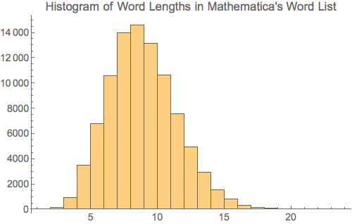

# word-anagrams
Find all word anagrams

## Are word anagrams rare?

If word anagrams are rare, then a dictionary transforming function is the way to go. Typical dictionaries are in the 100K size range. The following is a histogram of word lengths as found in Mathematica's stock word dictionary

The most common word length is 9 characters long and comes in at 14K. This is an upper bound for the possible anagrams because not all the words are anagrams of each other. Since 14K is much less than 9! we must conclude that anagrams are indeed rare and most n! permutations of a word of size n would be misses.

## First implementation

The first implementation will therefore concentrate on creating a hash map of the dictionary words keyed by a sorted list of its characters. The value at the key will be all the dictionary anagrams of that list of characters.

### Python implementation

	% python py/word_anagrams.py -h
	usage: Finds all anagrams in dictionary for supplied word. [-h]
	                                                           [--dictionary-file 	DICTIONARY_FILE]
	                                                           [--words WORDS [WORDS ...]]
	
	optional arguments:
	  -h, --help            show this help message and exit
	  --dictionary-file DICTIONARY_FILE, -d DICTIONARY_FILE
    	                    File containing dictionary words, one word per line.
 	 --words WORDS [WORDS ...], -w WORDS [WORDS ...]
 	                        Source words for anagrams search

